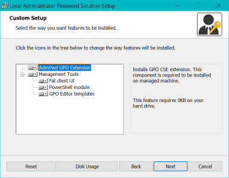

# Deploying the Local Administrator Password Solution (LAPS)

Membership in the "Schema Admins" and "Domain Admins" security groups are required to configure the Active Directory domain for LAPS.
To avoid pash-the-hash attacks, members of priviliged Active Directory groups, such as "Schema Admins" and "Domain Admins", should only logon to domain controllers and not to down-level member servers. Therefore, all the instructions below should be carried out on a writeable Domain Controller, not an RODC (Read-Only Domain Controller), with the Remote Server Administration Tools for Active Directory Domain Services Installed (the Active Directory PowerShell module is required by the script).

  <ol>
    <li>
      <H3>Install LAPS on an Active Directory Domain Controller</H3>
      <ol>
        <li>Install all product features of LAPS, including the FAT client, AdmPwd.PS PowerShell module, and Group Policy Administrative Template</li>
        <li>On Windows Server with Desktop Experience, double-click the "LAPS.x64.msi" installer package, click on the drop-down arrow beside "Management Tools" and select "Entire feature will be installed on local hard drive
          

        </li>
        <li>On Windows Server Core, using the following installation command: msiexec.exe /i LAPS.x64.msi /q ADDLOCAL=CSE,Management.UI,Management.PS,Management.ADMX</li>
      </ol>
    </li>
    <li>
      <H3>Prepare the Active Directory domain for LAPS</H3>
      <ol>
        <li>Schedule a Maintenance Window</li>
        <li>Take a System State Backup or a BareMetal Backup of the Domain Controller. Alternatively you could backup the Active Directory NTDS database using ntdsutil.exe</li>
        <li>Run the PowerShell script "Configure-ADDomain.ps1" to perform the following:
        <ol>
          <li>Extend the Active Directory Schema</li>
          <li>Grant Computers the ability to store the local Administrator password in Active Directory</li>
          <li>Grant Users and Groups the ability to view and reset the local Administrator passwords stored in Active Directory</li>
          <li>Copy the LAPS Administrative Template files to the Group Policy Central store (if configured for the domain)</li>
        </ol>
          <H4>Get-Help .\PrepareADforLAPS.ps1 -Full</H4>
        </li>
      </ol>
    </li>
    <li><H3>Configure the LAPS Group Policy settings</H3>
      On the same domain controller where LAPS is installed or (if the domain is configured with a Group Policy Central Store) on any member server with the Group Policy Management Tools installed, create a new Group Policy Object or edit an existing one. The minimum required setting to enable LAPS is "Computer Configuration" -> "Policies" -> "Administrative Templates" -> "LAPS" -> "Enable local admin password management". Link the Group Policy Object to the Organizational Units specified when running the Configure-ADDomain.ps1 PowerShell script.
    </li>
    <li><H3>Install the LAPS Client-Side Extension on all managed computers</H3>
    Use Group Policy Software Installation or an Endpoint Configuration/Management Product, such as Microsoft Endpoint Manager, to silently install the LAPS Windows Installer package to all computers: msiexec.exe /i LAPS.x64.msi /q
    </li>
  </ol>

